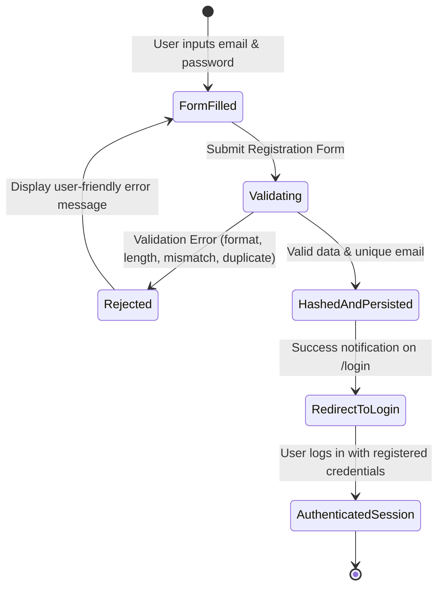

# Data Model: Account Creation and Password Hashing

## Entities

### `admins` Table (SQLite)

The application stores local credentials in the existing `admins` table.

```sql
CREATE TABLE admins (
  id INTEGER PRIMARY KEY,
  username TEXT UNIQUE,
  hashed_password TEXT
);
```

### Attributes

| Column | Type | Constraints | Description |
|:---|:---|:---|:---|
| `id` | `INTEGER` | `PRIMARY KEY AUTOINCREMENT` | Unique identifier for the account record. |
| `username` | `TEXT` | `UNIQUE NOT NULL` | Normalized email address (trimmed, converted to lowercase). |
| `hashed_password` | `TEXT` | `NOT NULL` | Cryptographic hash with salt generated via bcrypt (`$2b$12$...`). |

---

## Validation Rules

1. **Email (`username`)**:
   - Must not be empty.
   - Must be trimmed of leading and trailing whitespace.
   - Must be stored in lowercase for case-insensitive uniqueness.
   - Must match RFC-compliant email structure (`^[^@\s]+@[^@\s]+\.[^@\s]+$`).
   - Must be unique across all records in `admins` table.
2. **Password**:
   - Must be at least 8 characters in length.
   - Must not consist exclusively of whitespace characters.
   - Must strictly match the `password_confirm` submission.
3. **Password Hash (`hashed_password`)**:
   - Generated with bcrypt cost factor 12.
   - Plaintext passwords must never be stored in the database or included in logs.

---

## State Transitions & Lifecycle



1. **Unregistered**: User has not created an account.
2. **Submitted**: Form submitted via IPC `register` command to Rust backend.
3. **Persisted**: Rust verifies constraints, hashes password with bcrypt, inserts record into SQLite `admins` table.
4. **Active Credential**: The account is ready to authenticate. During `login`, `auth::verify_credentials` verifies the password against `hashed_password` and opens an in-memory session.
